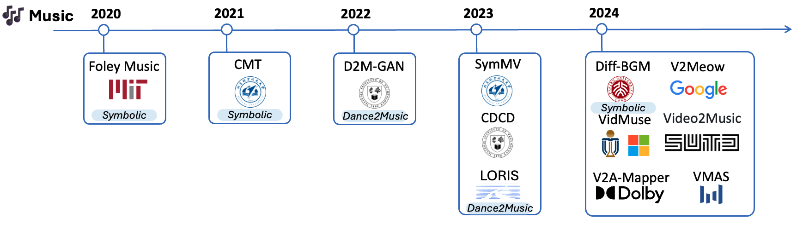

#  Awesome-Vison2Audio
A curated list of Vison to Audio Generation

##   Paper List

### 2025
- 2025 🔉 VAFlow: Video-to-Audio Generation with Cross-Modality Flow Matching, ICCV'25
- 2025 🔉 Foley-Flow: Coordinated Video-to-Audio Generation with Masked Audio-Visual Alignment and Dynamic Conditional Flows, CVPR'25
- 2025 🎶 GVMGen: A General Video-to-Music Generation Model with Hierarchical Attentions
- 2025 🎶 AudioX: Diffusion Transformer for Anything-to-Audio Generation
- 2025 🎶 FilmComposer: LLM-Driven Music Production for Silent Film Clips, CVPR'25
- 2025 🎶 HarmonySet: A Comprehensive Dataset for Understanding Video-Music Semantic Alignment and Temporal Synchronization, CVPR'25
- 2025 🎶 Extending Visual Dynamics for Video-to-Music Generation
- 2025 🔉 Synchronized Video-to-Audio Generation via Mel Quantization-Continuum Decomposition, CVPR'25

### 2024
- 2024  🎶 VMAs: Video-to-Music Generation via Semantic Alignment in Web Music Videos, ByteDance, [🌐 Demo](https://genjib.github.io/project_page/VMAs/index.html)
- 2024  🎶 MM-LDM: Multi-Modal Latent Diffusion Model for Sounding Video Generation, Institute of automation, MM'24
- 2024 Jul. 🔉 FoleyCrafter: Bring Silent Videos to Life with Lifelike and Synchronized Sounds. Shanghai Artificial Intelligence Laboratory, Chinese University of Hong Kong, Shenzhen. [🌐 Demo](https://foleycrafter.github.io/) [🔗 Code](https://github.com/open-mmlab/FoleyCrafter) [🤗 HF](https://huggingface.co/ymzhang319/FoleyCrafter) Datasets (VGGSound, AVSync15)
- 2024 Jul. 🔉 FRIEREN: Efficient Video-to-Audio Generation with Rectified Flow Matching. ZheJiang University. [🌐 Demo](https://frieren-v2a.github.io/) Datastes (VGGSound)
- 2024 Jul. 🔉 Masked Generative Video-to-Audio Transformers with Enhanced Synchronicity. Dolby Lab. ECCV'24. [🌐 Demo](https://maskvat.github.io/) Datastes (VGGSound)
- 2024 Jul. 🔉 Read, Watch and Scream! Sound Generation from Text and Video, NAVER. [🌐 Demo](https://naver-ai.github.io/rewas/) Datastes (VGGSound)
- 2024 June. 🎶 VidMuse: A Simple Video-to-Music Generation Framework with Long-Short-Term Modeling, HKUST, Microsoft Research Asia.  [🔗 Code](https://github.com/ZeyueT/VidMuse/) Datasets (V2M).
- 2024 May. 🔉 Visual Echoes: A Simple Unified Transformer for Audio-Visual Generation, Sony. [image2audio]. [🌐 Demo](https://docs.google.com/presentation/d/1ZtC0SeblKkut4XJcRaDsSTuCRIXB3ypxmSi7HTY3IyQ/edit#slide=id.g2cca3e60f2e_1_118) Datasets (VGGSound)
- 2024 Feb. 🔉 Seeing and Hearing: Open-domain Visual-Audio Generation with Diffusion  Latent Aligners, HKUST, CVPR'24. [🌐 Demo](https://yzxing87.github.io/Seeing-and-Hearing/) [🔗 Code](https://github.com/yzxing87/Seeing-and-Hearing) Datasets (VGGSound)
- 2024 🎶 V2Meow: Meowing to the Visual Beat via Video-to-Music Generation, Google. AAAI'24. [🌐 Demo](https://google-research.github.io/noise2music/v2meow/) Dataset (MV100K)
- 2024 🎶 Diff-BGM: A Diffusion Model for Video Background Music Generation, PKU, CVPR'24. [🔗 Code](https://github.com/sizhelee/Diff-BGM) Datasets (BGM909)
- 2024 🎶 MeLFusion: Synthesizing Music from Image and Language Cues using Diffusion Models, Adobe, CVPR'24. [🔗 Code](https://github.com/schowdhury671/melfusion/tree/main) [🌐 Demo](https://schowdhury671.github.io/melfusion_cvpr2024/)
- 2024 🔉 From Vision to Audio and Beyond: A Unified Model for Audio-Visual Representation and Generation, University of Washington, ICML'24. 
- 2024 🔉 SonicVisionLM: Playing Sound with Vision Language Models, Shanghai University, CVPR'24 [🌐 Demo](https://yusiissy.github.io/SonicVisionLM.github.io/)
- 2024 🎶 Video2Music: Suitable music generation from videos using an Affective Multimodal Transformer model, SUTD, EXPERT SYST APPL'249. [🔗 Code](https://github.com/AMAAI-Lab/Video2Music). Datasets (MuVi-Sync)
- 2024 🔉 V2A-Mapper: A Lightweight Solution for Vision-to-Audio Generation by Connecting Foundation Models, Dolby, AAAI'24. [🌐 Demo](https://v2a-mapper.github.io/)
- 2024 🎶 DanceComposer: Dance-to-Music Generation Using a Progressive Conditional Music Generator, Sun Yat-sen University, TMM'24
- 2024 🔉 Video-Foley: Two-Stage Video-To-Sound Generation via Temporal Event Condition For Foley Sound, KAIST. [🌐 Demo](https://jnwnlee.github.io/video-foley-demo/)
- 2024 🔉 LoVA: Long-form Video-to-Audio Generation, RUC. Datasets(AudioSet, VGGSound, UnAV100)
- 2024 🔉 Tell What You Hear From What You See - Video to Audio Generation Through Text, University of Washington, NeurIPS'24 [🔗 Code](https://github.com/DragonLiu1995/multimodal-llm-for-audio-gen)

### 2023
- 2023 Aug. 🎶 Video Background Music Generation: Dataset, Method and Evaluation, Beihang University, ICCV'23. [🔗 Code](https://github.com/zhuole1025/SymMV) Datasets (SymMV)
- 2023 Jun. 🔉 DiffFoley: Synchronized Video-to-Audio Synthesis with Latent Diffusion Models, Tsinghua University, NIPS'23. [🌐 Demo](https://diff-foley.github.io/) [🔗 Code](https://github.com/luosiallen/Diff-Foley) Datasets (VGGSound, AudioSet)
- 2023 Feb. 🎶 Discrete Contrastive Diffusion for Cross-Modal Music and Image Generation, Illinois Institute of Technology, ICLR'23. [🌐 Demo](https://l-yezhu.github.io/CDCD/) [🔗 Code](https://github.com/L-YeZhu/CDCD) Datasets (AIST++, Tiktok Dance-Music)
- 2023 🔉 MM-Diffusion: Learning Multi-Modal Diffusion Models for Joint Audio and Video Generation, Renmin University of China CVPR'23. [🔗 Code](https://github.com/researchmm/MM-Diffusion) Datasets (Landscape, AIST++)
- 2023 🔉 Conditional Generation of Audio from Video via Foley Analogies, University of Michigan, Adobe, CVPR'23 [🌐 Demo](https://xypb.github.io/CondFoleyGen/) [🔗 Code](https://github.com/XYPB/CondFoleyGen)
- 2023 🎶 Long-Term Rhythmic Video Soundtracker,Shanghai Artificial Intelligence Laboratory, ICML'23 [🌐 Demo](https://justinyuu.github.io/LORIS/) [🔗 Code](https://github.com/OpenGVLab/LORIS)
- 2023 🔉 CMMD: Contrastive Multi-Modal Diffusion for Video-Audio Conditional Modeling, Microsoft

### 2022 
- 2022 Jul. 🎶 Quantized GAN for Complex Music Generation from Dance Videos, Illinois Institute of Technology, ECCV'22. [🌐 Demo](https://l-yezhu.github.io/D2M-GAN/) [🔗 Code](https://github.com/L-YeZhu/D2M-GAN) Datasets (AIST++, Tiktok Dance-Music)

### 2021
- 2021 Nov. 🎶 Video Background Music Generation with Controllable Music Transformer, Beihang University, MM'21. [🌐 Demo](https://wzk1015.github.io/cmt/) [🔗 Code](https://github.com/wzk1015/video-bgm-generation) 🌟
- 2021 🔉 How Does it Sound? Generation of Rhythmic Soundtracks for Human Movement Videos. University of Washington, NeurIPS'21 [🔗 Code](https://github.com/shlizee/RhythmicNet)
  
### 2020
- 2020 Jul. 🔉 Generating Visually Aligned Sound from Videos, South China University of Technology, TIP'20. [🌐 Demo](https://www.youtube.com/watch?v=fI_h5mZG7bg) [🔗 Code](https://github.com/PeihaoChen/regnet) 
- 2020 Jul. 🎶 Foley Music: Learning to Generate Music from Videos, MIT.
- 2020 Jun. 🔉 Audeo: Audio Generation for a Silent Performance Video, University of Washington.

### 2019
- 2019, 🎶 AIST Dance Video Database: Multi-Genre, Multi-Dancer, and Multi-Camera Database for Dance Information Processing, AIST, ISMIR'19. 

### 2018
- 2018 Jun. 🔉 Visual to Sound: Generating Natural Sound for Videos in the Wild, University of North Carolina, CVPR'18. 
- 2018, 🔉 Visually Indicated Sound Generation by Perceptually Optimized Classification, University of Southern California, ECCV MULA workshop'18. [🔗 Code](https://github.com/kanchen-usc/VIG)

### 2016
- 2016 🔉 Visually Indicated Sounds, MIT, CVPR'16. [🌐 Demo](https://andrewowens.com/vis/) [🔗 Code](https://github.com/GeorgeEfstathiadis/Visually-Indicated-Sounds)

##  Survey
- 2025 Mar. Vision-to-Music Generation: A Survey.  [🔗 Code](https://github.com/wzk1015/Awesome-Vision-to-Music-Generation).
- 2024 Aug. Foundation Models for Music: A Survey, Queen Mary University of London.
- 2024 Jun. LLMs Meet Multimodal Generation and Editing:  A Survey, HKUST. [🔗 Code](https://github.com/YingqingHe/Awesome-LLMs-meet-Multimodal-Generation).
- 2022 Aug. Learning in Audio-visual Context: A Review, Analysis, and New Perspective, Renmin University of China.
- 2023 Sep. Sparks of Large Audio Models: A Survey and Outlook, Queensland University of Technology.

##  Datasets

- 🎶 V2M (Unpublished): VidMuse: A Simple Video-to-Music Generation Framework with Long-Short-Term Modeling. (Movie trailer, 190K for training, 20K for finetuning, 300 for benchmarking).
- 🔉 [VGGSound](https://huggingface.co/datasets/Speech-Audio/VGGSOUND/tree/main): Vggsound: A large-scale audio-visual dataset. ICASSP'20
- Landscape
- 🎶 [Tiktok Dance Dataset](https://www.kaggle.com/datasets/yasaminjafarian/tiktokdataset)
- 🔉 AVSync15: Audio-synchronized visual animation.
- 🎶 [BGM909](https://sizhelee.github.io/publication/bgm909.html). Piano version music. Diff-BGM: A Diffusion Model for Video Background Music Generation
- 🎶 MV100K: V2Meow
- 🎶 [MMTrailer](https://huggingface.co/datasets/litwell/MMTrail-20M): A Multimodal Trailer Video Dataset with Language and Music Descriptions.
- 🎶 [SymMV](https://github.com/zhuole1025/SymMV/tree/main/dataset): Video Background Music Generation: Dataset, Method and Evaluation.
- 🔉 [VAS](https://drive.google.com/file/d/14birixmH7vwIWKxCHI0MIWCcZyohF59g/view): Generating Visually Aligned Sound from Videos.
- 🎶 [AIST++](https://google.github.io/aistplusplus_dataset/download.html). Dance-to-Music
- 🎶 [AIST](https://aistdancedb.ongaaccel.jp/). Dance-to-Music
- 🎶 [MuVi-Sync](https://zenodo.org/records/10057093). Video2Music: Suitable Music Generation from Videos using an Affective Multimodal Transformer model

##  Evaluation Metrics

- [Frechet Audio Distance, KL](https://github.com/haoheliu/audioldm_eval)
- [Density, Coverage](https://github.com/clovaai/generative-evaluation-prdc)
- Video-Music CLIP (Precision)/CLIPScore
- [Music Quality (mgeval)](https://github.com/RichardYang40148/mgeval): Rhythms, Genre, Coherence, Quality ....
- [ImagebindScore](https://github.com/facebookresearch/ImageBind)
- [mir_eval](https://github.com/craffel/mir_eval)

## 🧩 Want to Contribute?

We welcome contributions! Please feel free to submit a PR or open an issue if you'd like to add new papers, tools, or correct any mistakes.

### ✅ Guidelines:
- Add relevant papers or projects related to Vision2Audio.
- Use consistent formatting.
- Include links where available.
